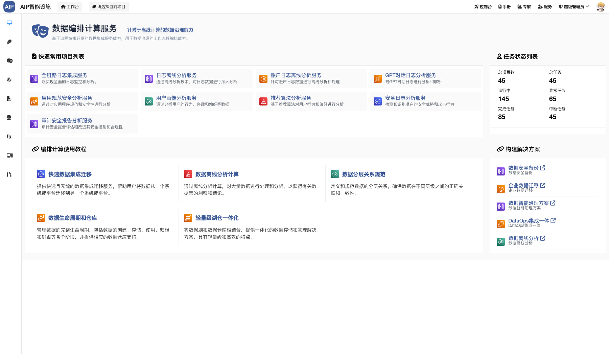
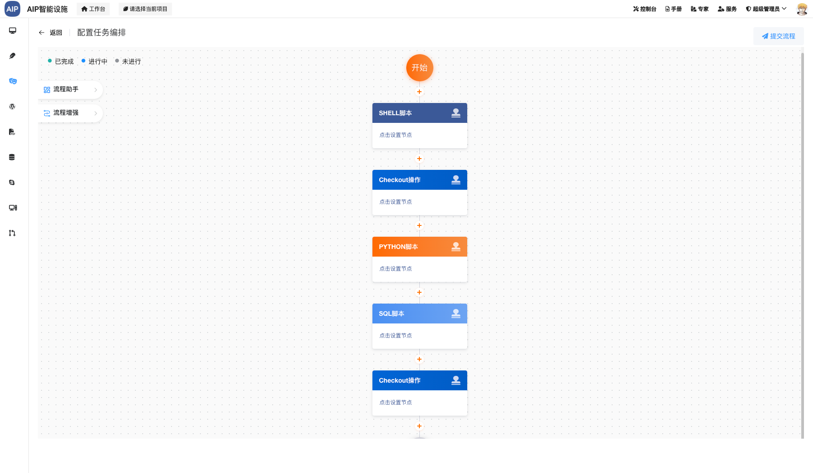
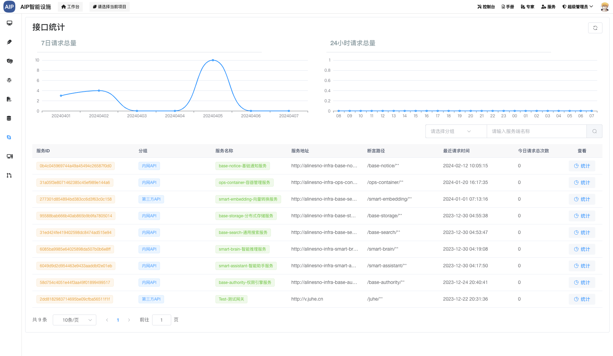

# alinesno-infra-data-scheduler

定时任务编排服务，使用多任务实例和编排可视化管理

## 支持任务类型

|序号|任务类型|进度|备注|说明|
|---|-------|----|----|----|
|1  |Checkout|80% |测试中|实现代码版本控制系统的检出功能，允许开发者从远程仓库获取最新代码。|
|2  |Http    |10% |测试中|开发HTTP客户端或服务器端的功能，用于处理网络请求和响应。|
|3  |Jar     |0   |开发中|创建或优化Java Archive (JAR) 文件打包过程，便于分发和部署Java应用程序。|
|4  |K8S     |0   |开发中|开发针对Kubernetes（K8S）的操作功能，包括但不限于应用的部署、扩展和管理等。|
|5  |Maven   |80% |测试中|改进Maven构建工具的使用，确保项目依赖管理和构建过程的一致性和高效性。|
|6  |Notice  |0   |开发中|开发回调通知系统，支持通过企业微信机器人发送通知给指定用户或群组。|
|7  |Python  |50% |开发中|编写或重构Python脚本/程序，可能涉及数据分析、自动化脚本或其他业务逻辑。|
|8  |Shell   |80% |测试中|编写Shell脚本，用于执行一系列命令行操作，如文件处理、系统维护等。|
|9  |SQL     |90% |开发中|执行多行SQL脚本，包括数据库查询语句|

## 产品界面

> 以下为项目部分界面

<table>
  <tr>
    <td>
      
    </td>
    <td>
      
    </td>
  </tr>
  <tr>
    <td>
      
    </td>
    <td>
    </td>
  </tr>
</table>

## 性能要求

性能指标：

- 定时任务支持不少于2000个
- 任务时长最大不少于12小时

## 表设计

系统表

- project 项目表
- datasource 数据源表
- environment 运行环境表
- udfs 用户自定义函数表
- resources 资源表
- alert 告警配置表

流程表设计

- process_definition 流程定义表
- process_instance 流程实例表
- process_definition_task_relation 流程定义任务关联表
- task_definition 任务定义表
- task_instance 任务实例表

## 鸣谢

- 集成学习参考资料[Quartz应用与集群原理分析](https://tech.meituan.com/2014/08/31/mt-crm-quartz.html)
- 集成定时任务框架[quartz](https://github.com/kagkarlsson/db-scheduler)
- 执行任务参数参考[任务总体存储结构](https://docs.devlive.org/read/apache-dolphin-scheduler-zh-3.2.1/Architecture-Task-Structure)
- 流程设计器参考[smart-flow-design](https://gitee.com/crowncloud/smart-flow-design)
